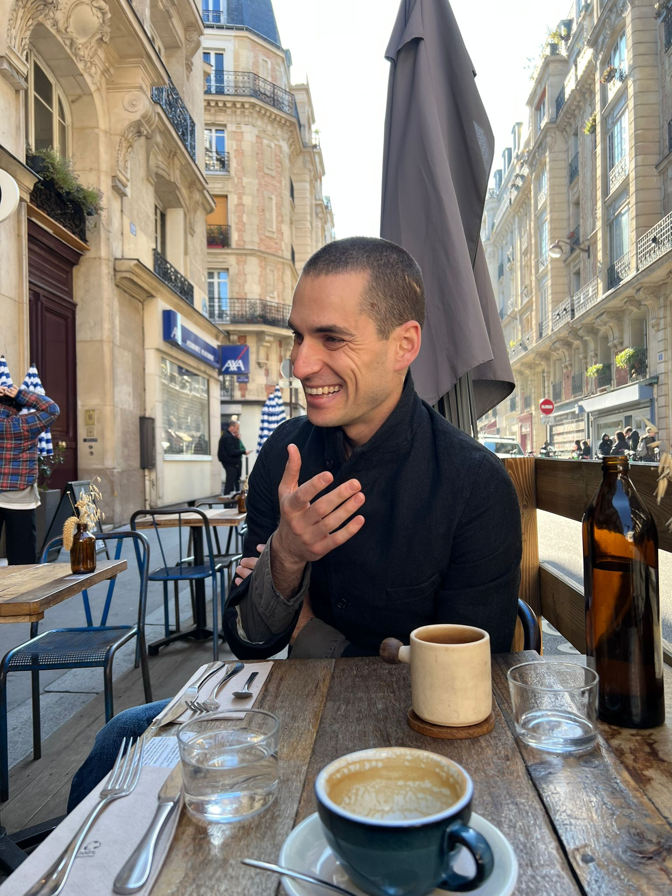

# On Axioms, Inversions, and the Integrated Information of Phenomenal Existence

To experience one’s own world, to hold phenomenal content in one’s experience, to know what it is like to be you–these are the murmuring qualities of conscious experience. Though almost given from our subjective perspective, it has often been quite maddening to approach scientifically. How conscious experience can even emerge from the vast amount of electrical activity, that imperceptibly–but surely–is structured within an organic mass of living tissue is thought-wrenching. And one, that for me nonetheless, is worth spending some time on.

I have grappled with the concept of emergence from a practical perspective in my own research. Most of my research is centred around developing operational measures of emergence and applying them to complex neural systems. However, it is with the intent to distinguish how they might inform theories of consciousness that lay beneath the veil. That which spurs the deep dive. The most applicable of which is Integrated Information Theory (IIT), as it, too, tries to contextualise conscious experience as the informational constitutive closure that is–in some sense–greater than the sum of its parts.

Integrated Information Theory (IIT) attempts to develop a formal approach to understanding phenomenal consciousness in physical terms. Grounded in mathematical rigour, it has often attracted criticism of its axiomatic foundations. Notwithstanding the insight of some of these critiques, it has–to me–mobilised a current clarification as to the nature of the axioms and postulates. Here, what I discuss and propose is a type of generalisation of the notion of axioms; softening their tethering to strict mathematical formal systems. Illustrating that IIT postulates are inferred via adbuction or by inference to best explanation, offering a nuanced distinction between the axiomatic approach in IIT and oother formal mathematical systems. And indeed, in can be taken that inferring conscious experiences within IIT stands seperate from proving theorems in formal mathematical systems. Then, I try and clarify–from my interpretation–what utility the formulation of the axioms and postulates, in their current state, serve. I also advocate that indeed much of the axiomatisation in mathematics occurs *post factum*, and can at times be a recursive process between postulates and axioms. This interpretation is expressed in order to aid in the progress towards understanding what IIT truly proposes to evaluate.

## 1. Criticisms of Axiomatic Structure

Formal systems, primarily based on the axiomatisation of mathematical expositions of patterns, structure and phenomena–and sometimes–mathematical objects themselves are endowed with statements that dictate the foundational base of suppositions and prepositions that can be claimed as true or false within those systems. Simply, axioms are some set of self-evident statements that are true for all other statements that can be generated within the formal system. In 1931, a remarkable mathematician and logician Kurt Gödel, published a proof of the paradoxical nature of all arithmetised formal systems.

Gödel showed, that once we arithmetise all statements in our formal system, our system cannot be both complete and consistent. He showed that if our system is complete, possessing a set of axioms that are fully determined–i.e., where we cannot add extra axioms–then the system will possess truth statements that are not provable from the axioms alone: there might be contradictions in the proof. In the context of IIT and phenomenal consciousness, this would mean that there are conscious experiences that cannot be proved from the axioms alone.

However, and herein lay the paradoxical nature: if every statement can be proved–by rules of inference–from the axioms of the formal system, i.e., if the system is consistent, then it is fundamentally incomplete! There can always be another axiom that can be added! Again, in the context of IIT and conscious experience this would indicate that if all conscious experience can be proved by inference from the axioms, then the axioms are not complete; there could be an extra axiom of conscious experience that can be added.

Though this fundamental proof shook the mathematical world, it did not altogether halt progress. Mathematicians kept working in their respective fields, developing better methods of prediction and postulating useful statements that altogether propelled progress in fields such as electrodynamics, quantum field theory, and evolution. Further, the progress and predictive power cemented the methods as robust formal approaches in understanding the reality in which we live and how we fundamentally understand these distinct phenomena.

Similarly, it seems to me that criticisms of the axiomatic formalism of IIT broadly fall into these two camps: either there are arguments about the incompleteness of the axioms and that they are not encompassing of the total repertoire and variations of conscious experience; or, they are arguments about the inconsistency; that Φ as a measure of consciousness might not be unique and that the Φ-structures are not indicative of phenomenal experiences. Notwithstanding the valid arguments on which some of these criticisms are based on and, as explained above, altogether inherent in formal systems, they should be used as cautionary gestures and not as overhaul solutions to scrapping the foundations of IIT. If history is to serve us as a wise teacher, progress can be made even in light of these inherent limitations.

To aid in this attempt, I will use a case example of how axioms have been formulated in another branch of mathematics–Group Theory–that usually is quite different to how, Group Theory is taught and presented. Indeed, this progress is not uncommon and transcends across mathematical disciplines. Then, in this light, I hope to elucidate the nature of axioms and postulates in IIT. I intend to propose an inversion of focus from axioms to postulates and with this, a nuanced shift in terminology used to explain them. With this inversion, it is reasonable to suggest that the axioms can be substantiated post factum. Which reflects how most mathematical and formal approaches to other phenomena have developed axioms after the fact rather than as the starting point. Though indeed, they are useful guideposts in establishing a mathematical framework for phenomenal experience. Hopefully this shows IIT parallels the progress made in other mathematical fields.

## 2. Development of Axioms in Mathematics

Contrary to how axiomatic approaches are pedagogically presented, the development of formal mathematical systems has not progressed from axioms, but toward them. After the development of a candidate theory has reached a certain threshold of understanding axioms are refuted or reinforced: similarly to the way one might write an abstract at the end of finishing the first draft of a paper.

Take for example the much beloved (personal bias here!) mathematical study of groups and the develop of Group Theory within Abstract Algebra. A group can be simply defined as a set of constituent elements with an operation that can be used to relate any two elements in that group. This group is them endowed with some basic axioms that we will not divulge into here. What is of illustrative importance is the development of Group theory.

Group theory in itself evolved from a number of parallel sources: Gauss’ modular arithmetic, Euler’s expositions in number theory, Abel’s work on solving polynomial equations, and the list goes on. It all culminated with Évariste Galois who first defined these mathematical expositions as a “group” in the earlier half of the 19th century. A fascinating character himself who died at the age of 20 after he was injured in a duel. Only by 1882 did Walther von Dyck define the axiomatic statements of Group Theory after a century of progress on group structures and their utility in a variety of parallel mathematical systems. It was progress from Galois’ recognition of the similarity of self-evidential statements about groups in different fields, up until von Dyck’s indoctrination of these pos- tulates as generated from corresponding axioms that Group theory developed as a formal system. Indeed, Group theory continued to develop after this; pivoting the basic interpretation of the axioms in progressive new discoveries such as Lie and Algebraic groups.

And though we now teach Group theory by presenting the axioms that define a group first, the evolution of Group theory has progressed in the opposing direction: toward the axioms. It would seem, that most mathematical systems have evolved in a similar fashion.

## 3. On the clarity of IIT’s axioms and postulates

Formal mathematical systems, in general, have developed rules of inference based on deduction and sometimes inductive reasoning. And it is indeed these systems on which Gödel’s paradoxical proof is developed, particularly deductive inference rules. However, IIT differs crucially in this regard which I will explain below. Also, to the best of my knowledge IIT developers have not stated that IIT is a mathematical theory of consciousness, but rather that it is a mathematical framework. this is a brief, but important distinction in clarifying the confusion with what place the axioms hold within the theory. Though IIT proposes to be a theory of consciousness, it is not a mathematical theory of consciousness, but a theory of consciousness within a mathematical framework. With this, it allows us to loosen the tethering of how we define our axioms in relation to postulates and vice versa.

IIT takes axioms as self-evident truths regarding intrinsic existence. It is existence from the intrinsic perspective that is of primary interest here. IIT’s assumption then, is that phenomenal experience is defined with recourse to intrinsic existence. These axioms then serve as the basic building blocks that define any structure from its intrinsic perspective. This nuanced but key dis- tinction serves as an important pivoting of perspective. How a structure of-itself is defined intrinsically becomes the starting point. Hence the zeroth axiom–that phenomenal consciousness exists–is the premise on which the other axioms’ self-evidential quality begins to make sense.

For some structure to intrinsically (*1st*) exist, that said existence (*0th*) needs to be from the perspective of the structure itself: it exists within, and of, itself. The existence of the structure contains information (*2nd*); it specifies something. The structure is integrated (*3rd*); it is a whole and the information it possesses as a whole is not reducible to its constituents. In general, the information cannot be broken down into constituents. This structure, excludes (*4th*) other structures; it has a defined closure within a specific temporal and spatial scale. Lastly, this structure is compositional (*5th*); the structure is structured by a collection of constituents. These are the 6 axioms of IIT. 

Simply, IIT defines the existence (*0th*) of the irreducible (*3rd*), informational (*2nd*) closure (*4th*) of a collection (*5th*) of interacting parts (*1st*). 

As you might have noticed, I have presented the axioms as that of the intrinsic existence and avoided the use of definitions that evoke phenomenal experience. Consciousness, phenomenology, experience, subjective, are all terms that have been avoided in order to illustrate my perspective and bolster intuition on the IIT axioms.

Minor disagreements aside, in science we tend to agree on the general definition that phenomenal experience is something it is like to be in a given state, or, something it is like to perceive some informational content, such as; the azure colour of the sky, the breathlessness after a long run, the touch of a lover’s hand. This, ‘something it is like’ fundamentally entails the perceiving being from the thing itself: an intrinsic perspective.

*For the experience to exist it must exist from the intrinsic point-of-view.*

It is by way of the existence of experience, that the axioms define an intrinsic perspective. Yes, it is argued that the IIT axioms correspond to fundamental properties of experience, but it is of the existence of experience in physical terms. In order to infer the existence of experience in physical terms we have to infer to the best explanation. As, from the intrinsic perspective, the only element that is given is the experience itself. Inference to the Best Explanation (IBE) is sometimes referred to as abduction. I will refrain from using that definition and stick to the former for clarity. It is via this route that we develop the postulates in IIT. Assuming we prescribe to existence being defined by the ability to be affected by things in the world, and in turn, effect things in the world, then formalisms of informational structures and information processing lend themselves as natural frameworks in which to situate postulates of intrinsic existence.

To define existence from the intrinsic perspective in physical terms the inferred self-evidential statements (postulates) assume a cause-effect power. The physical substrate of consciousness much have cause-effect power (*0th*) that is intrinsic (*1st*). This cause-effect power must specify some information between the constituent parts (*2nd*) that is integrated and irreducible to those same constituents (*3rd*). Importantly, this integrated causal structure must possess some degree of closure from other constituent elements integrated in the substrate (*4th*). And finally, as is obvious from the other axioms, the information structure is composed of constituents (*5th8). Therefore, the existence of all properties of an experience should be accounted for in physical terms because they correspond to an informational structure.

From this perspective, the abstraction away from ’consciousness’ in the definition of the axioms lend themselves directly to their transformation to postulates. Indeed, they could be taken as the postulates themselves if they refer to an information structure; or, to an experience if we rephrase them in terms of phenomenal consciousness. This isn’t the only time that I attempt to blur the boundaries between the two. As I’ve already mentioned, this cyclical correspondence between axioms and postulates is what mathematical progress has been built on.

## 4. Reframing the interpretation of IIT’s axioms

From my interpretation, IIT proposes much the same: from postulates that refer to the minimally necessary properties of information structures to exist intrinsically, it attempts to develop a formally grounded approach to the intrinsic existence of experience. A shared set of axioms that might define the existence of phenomenal experience. It is this added inversion of the relation between axioms and postulates that clarifies their interpretation, and that I propose here. It is through the process of Inference to the Best Explanation that we infer the credibility of the axioms, and how we derive the postulates. Though the exposition of IIT does begin with axioms, the practical work is done by using the postulates to develop testable predictions and infer (in an IBE sense) the degree of completeness of the axioms.

Ultimately, whether the axioms are complete, or whether IIT is a consistent theory (in the formal systems sense) of consciousness is an empirical question and will be decided by progress towards discerning its empirical validity. If we are to develop a theory of consciousness in physical terms similar to other formal theories of physical phenomena such as quantum fields or electrodynamics, a mathematically grounded approach such as IIT is warranted. Indeed, given that most of science has made progress by defining what things do rather than what things are, it is more likely that this process can always be refined. However, the goal posts of these 6 axioms might be very useful guides for progress–similar to Galois’ theory and his definition of a group.

What is proposed here is rather than critiquing the validity of the axioms of IIT, what has proved to be of greater benefit in all mathematically structured theories is to make progress on the correct operationalisation and application of the postulates in order to test and determine whether the postulates correspond to the axioms: the validity of which will unfold from this pursuit. Much of this progress is already proving positive. In my own research I attempt to develop the applicability of measures of emergence to neural systems in order to establish the functional closure of the irreducible information of sets of elements. Which, as already might be clear, evokes much of the postulates of IIT. How measures of emergence relate to IIT is an open question that would yield fruitful outcomes for both: how measures of emergence might inform theories of consciousness, and how IIT can be better framed for testability on neurophysiological data.

In an attempt to reframe how we interpret IIT’s axioms, my hope is that these boundaries will be blurred for the sake of progress towards scientifically understanding our most maddening and evocative of questions: that of who we are and what we are made of.

## Bio

I'm currently a Doctoral Researcher in Computational Neuroscience at the University of Melbourne where I explore formal measures of emergence and their application to neurophysiological data and complex neural systems in the context of how they might inform theories of consciousness. Practically, I use large-scale brain modelling, and information theory to explore theoretical concepts of complex dynamical systems such as brains. With a background in Neuroscience, Mathematics, Biochemistry, and Psychology I have a transdisciplinary approach to studying the mind, and a deep passion for communicating across disciplinary divides. Amongst other things, in my spare time I write creatively and train martial arts. Sporadically tweeting on @MilinkovBorjan